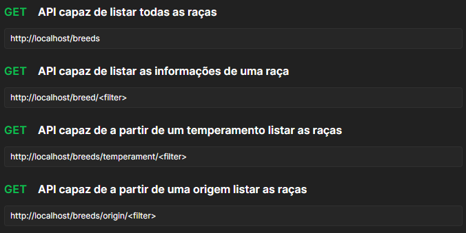

Cats API
=============
Documentação do projeto
-----------------------

Documentação da API
-------------------


Instalação
----------
- Instale o docker e o docker-compose
- Clone o projeto, entre na pasta raiz (onde o arquivo docker-compose.yml se encontra) e rode o seguinte comando:
```
docker compose up -d
```