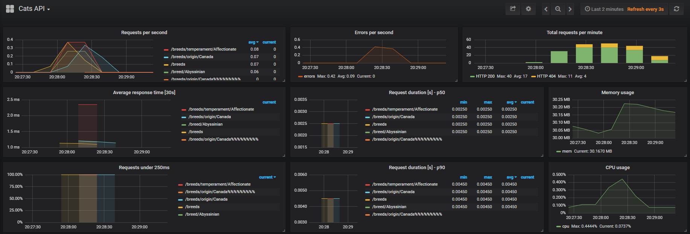

Cats API
=============
Documentação do projeto
-----------------------
- Para criação da API, foi utilizado Python com o framework Flask.

- Para consumir e guardar as informações do TheCatAPI, foi utilizado a stack Python + mongoDB.

- Para a monitoria de performance da API, foi utilizado o Grafana e Prometheus com uma lib do python chamada prometheus_flask_exporter. A lib expoe um endpoint (/metrics) na API, que é consumido pelo prometheus. Dessa forma o Grafana cria os gráficos baseado nessas informações gravadas no prometheus.

- Para a monitoria dos logs da API, foi utilizado o LogSeq com a lib seqlog que envia informações da API para o LogSeq. 


Documentação da API
-------------------
- API capaz de listar todas as raças [GET]
```
http://localhost/breeds
```

- API capaz de listar as informações de uma raça [GET]
```
http://localhost/breed/<filter>
```

- API capaz de a partir de um temperamento listar as raças [GET]
```
http://localhost/breeds/temperament/<filter>
```

- API capaz de a partir de uma origem listar as raças [GET]
```
http://localhost/breeds/origin/<filter>
```

_importar as collections do postman para testar as APIs (Cats.postman_collection.json)_


Instalação
----------
- [Pré-Req] Instale o docker e o docker-compose
- Clone o projeto, entre na pasta raiz (onde o arquivo docker-compose.yml se encontra) e rode o seguinte comando
```
docker compose up -d
```

Dashboard
---------
- Grafana com as métricas da API

_clique na imagem para aumentar_

---------------------------
- Seqlog com os logs da API


---------------------------
- Gráfico do grafana mostrando os erros do seqlog forçados pelo endpoint /error

